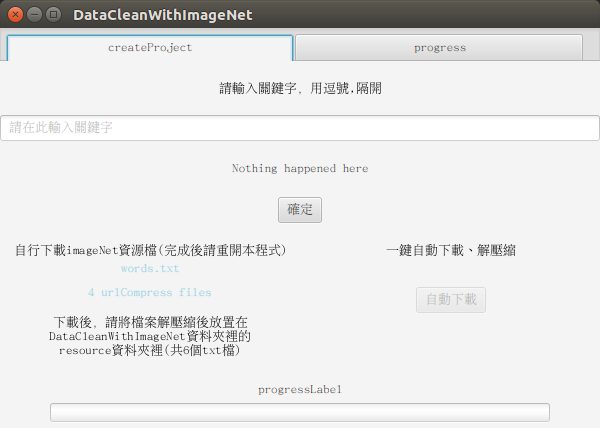
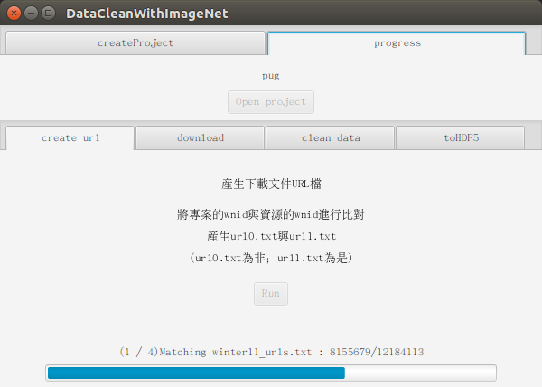
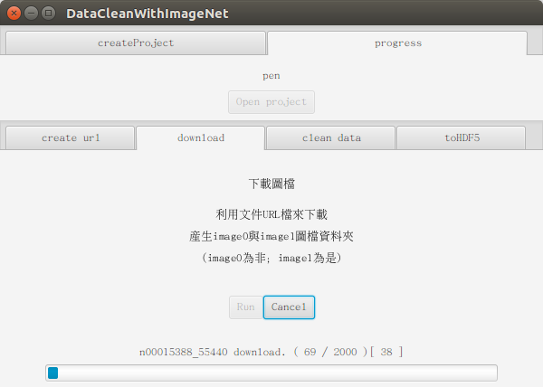
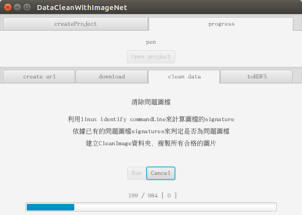
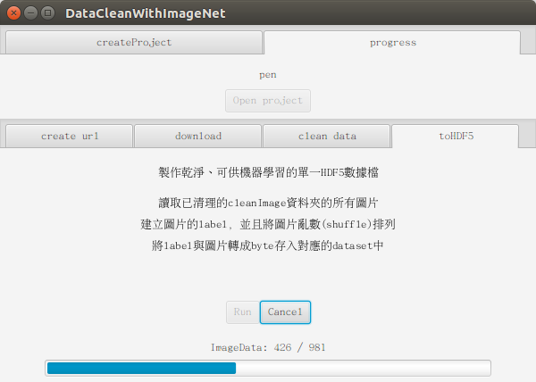

圖像資料蒐集小工具
===================

這是一個利用 <a href="http://image-net.org/" target="_blank">image-net.org</a> 資源所寫的小工具，

從使用者打關鍵字到製作成HDF5檔案以便機器學習使用。

----------

  - 頁面一：自行下載(開瀏覽器)、自動下解解壓縮、關鍵字串分割產生wnid

  - 頁面二：利用上一步wnid查找、產生下載連結

  - 頁面三：利用上一步下載連結，用多執行緒下載圖檔

  - 頁面四：利用上一步下載的圖檔，進行清理作業（clean data）

  - 頁面五：利用上一步的clean data，進行資料包裝、單一化以便後續處理


# 環境
Ubuntu 16.04

Java SDK 1.8.0_151

----------

# Libraries
OpenCV 3.3.0

jarhdf5-3.3.2

slf4j-api-1.7.5

slf4j-simple-1.7.5

tika-app-1.16

xmpcore-5.1.2

----------


編譯成jar執行程式後，需要加入hdf5和opencv的.so檔library路徑如下：

Command line 執行程式:

```
java -Djava.library.path=/native/library/path -jar JavaFXApp.jar
```

# License

MIT


